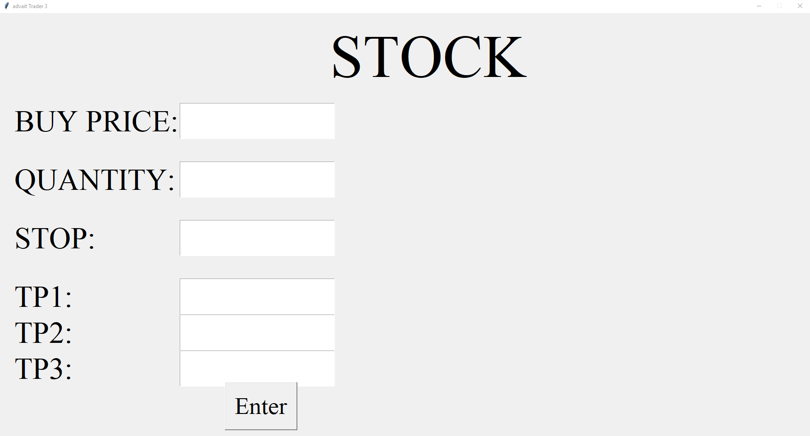
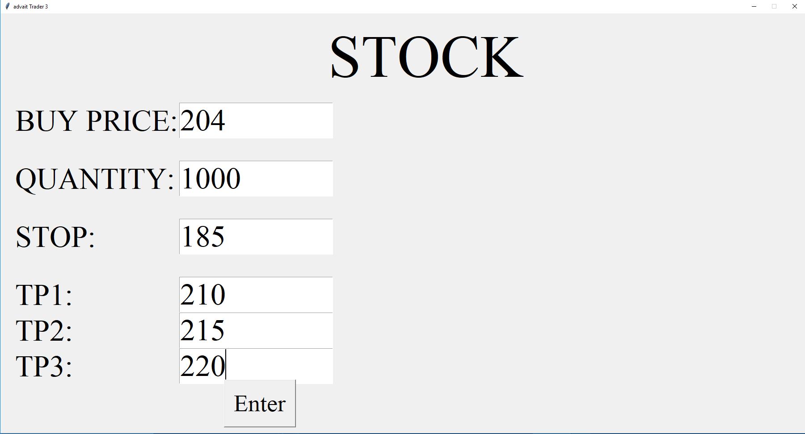
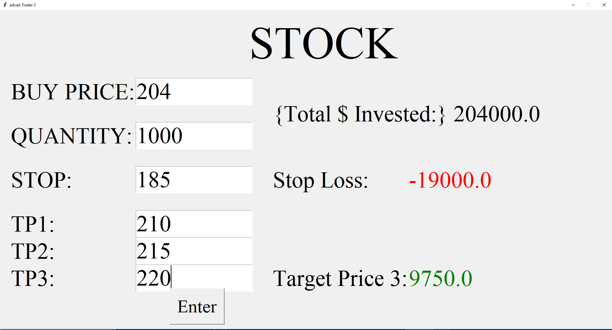
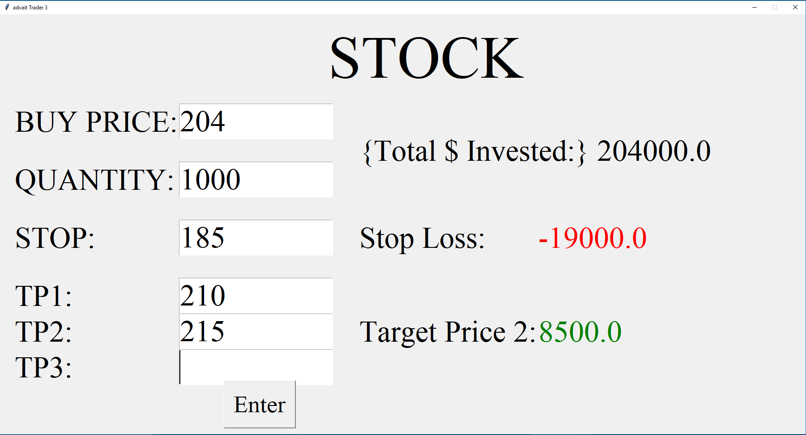
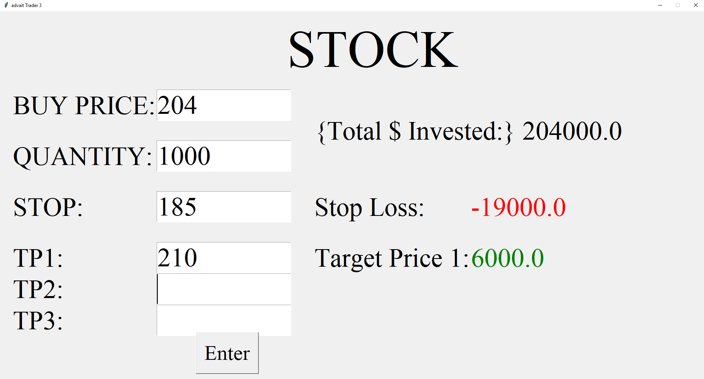

# GUI for calculating gains and losses from Stocks
A python GUI to calculate target price and stop losses for stocks. 

This is done by inputting your buy price and quantity plus stop, target 1,2,3 cost and then displaying the respective gains/losses. 
## Initial screen
### This is where you enter your stock details.

### Proceed to enter in your stock info

### Press enter and it reveals the calculated prices (the target price sells 50% then 25% and 25% at those respective values)

### It also works if you wish to do two sells (50% sell at each price)

### Of course, if you wish to just do one target price sell, it calculates selling 100% of the stock at that price 

*NOTE: this program was initially created for a family member in the US, hence the dollar sign, but this can very easily be changed for whichever coutry you trade in*
